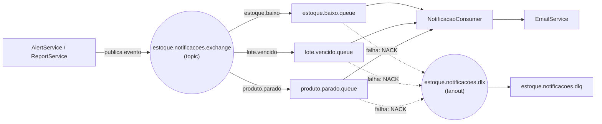

#  EstoqueFacil API


**Java • Spring Boot • PostgreSQL • RabbitMQ • Docker • Prometheus • Grafana • CI/CD • Observabilidade**

Sistema de gestão de estoque para controle de produtos, movimentações de entrada e saída, gerenciamento de lotes com data de validade, relatórios gerenciais, notificações automáticas por e-mail, auditoria completa de operações e monitoramento da aplicação em tempo real.

---

##  Visão Geral

API REST para controle de estoque que permite gerenciar produtos, categorias, movimentações de entrada e saída (vendas e perdas), controle de lotes com validade, relatórios inteligentes, notificações assíncronas de alertas críticos e auditoria de todas as ações.

O projeto foi desenvolvido com foco em:

- arquitetura em camadas
- segurança
- mensageria assíncrona (event-driven)
- observabilidade
- logs estruturados
- monitoramento de métricas
- containerização
- CI/CD
- boas práticas backend

---

##  Problemas Resolvidos

- Controle preciso de estoque com lógica FIFO (First-In-First-Out)
- Alertas automáticos para produtos com estoque baixo ou crítico
- Notificação por e-mail em tempo (quase) real quando um alerta é detectado, via fila de mensageria resiliente a picos e falhas
- Rastreabilidade completa através de logs de auditoria
- Relatórios financeiros e de performance para tomada de decisão
- Gestão de usuários com diferentes níveis de acesso
- Monitoramento da saúde da aplicação e banco de dados
- Observabilidade com métricas JVM, HTTP e conexões de banco

---

##  Público-Alvo

Pequenas e médias empresas que necessitam de um sistema de controle de estoque eficiente, com relatórios gerenciais, notificações automáticas, auditoria e monitoramento operacional da aplicação.

---

##  Tecnologias Utilizadas

| Tecnologia | Versão | Finalidade |
|------------|--------|------------|
| Java | 21 | Linguagem principal |
| Spring Boot | 3.5.11 | Framework principal |
| Spring Security | - | Autenticação e autorização |
| Spring Data JPA | - | Acesso a dados |
| Spring Boot Actuator | - | Health checks e métricas |
| RabbitMQ (Spring AMQP) | - | Mensageria assíncrona para notificações |
| Spring Mail | - | Envio de e-mails de alerta |
| Micrometer | - | Coleta de métricas |
| Prometheus | - | Monitoramento de métricas |
| Grafana | - | Visualização e dashboards |
| PostgreSQL | 15 | Banco de dados |
| JWT | - | Autenticação stateless |
| Logback (JSON) | 1.5.x | Logs estruturados |
| logstash-logback-encoder | 8.1 | Encoder JSON compatível com Logback 1.5.x |
| iText7 | 7.2.5 | Geração de PDF |
| Swagger/OpenAPI | 2.8.9 | Documentação |
| Docker | - | Containerização |
| GitHub Actions | - | CI/CD Pipeline |
| Maven | - | Gerenciador de dependências |
| Lombok | - | Redução de boilerplate |

---

##  Notificações Assíncronas (RabbitMQ)

Quando o sistema detecta um alerta — estoque abaixo do mínimo, lote vencido ou produto sem movimentação — o evento é publicado numa fila do RabbitMQ e processado de forma assíncrona, sem bloquear a requisição que originou a detecção.



### Como funciona

| Etapa | Responsável |
|---|---|
| Detecta o problema (estoque baixo, lote vencido, produto parado) | `AlertServiceImpl`, `ReportServiceImpl` |
| Publica o evento na exchange, com a routing key correspondente | `NotificacaoProducer` |
| Roteia a mensagem para a fila certa | RabbitMQ (binding por routing key) |
| Consome a mensagem e dispara o e-mail | `NotificacaoConsumer` + `EmailService` |
| Confirma o processamento (ACK) ou rejeita para a DLQ (NACK) | `NotificacaoConsumer` |

### Decisões de design

- **ACK manual** — o consumer só confirma a mensagem depois que o e-mail é efetivamente enviado. Se falhar, a mensagem é rejeitada com `basicNack(deliveryTag, false, false)` e vai automaticamente para a `estoque.notificacoes.dlq`, sem se perder.
- **Publisher confirms + returns** habilitados no `RabbitTemplate` — o sistema loga se o broker recusou a publicação ou se a mensagem não foi roteada para nenhuma fila, em vez de falhar silenciosamente.
- **Serialização em JSON** (Jackson) em vez de serialização Java nativa — permite inspecionar e até republicar mensagens manualmente pelo painel de gerenciamento do RabbitMQ.
- **Falha de notificação nunca quebra o fluxo principal** — toda publicação de evento é protegida por try/catch; um problema na mensageria não impede que um relatório ou resumo de alertas seja retornado.
- **Limitação conhecida:** como a detecção ocorre a cada chamada de `GET /reports/alerts/summary` (ou `/reports/loss`), chamadas repetidas ao mesmo endpoint podem gerar notificações duplicadas para o mesmo alerta. Está no roadmap mover essa detecção para um job `@Scheduled` com controle de idempotência.

---

##  Observabilidade e Monitoramento

### Stack de Observabilidade

| Ferramenta | Função | Porta |
|------------|--------|-------|
| Spring Boot Actuator | Health checks e métricas | `/actuator` |
| Micrometer | Coleta de métricas | - |
| Prometheus | Armazenamento de métricas | `9090` |
| Grafana | Visualização e dashboards | `3000` |
| Logback (JSON) | Logs estruturados | - |
| Correlation ID | Rastreabilidade | Header HTTP |
| RabbitMQ Management | Inspeção de filas e mensagens | `15672` |

### Métricas Monitoradas

**Técnicas (automáticas):**
- Uso de memória JVM (heap e non-heap)
- Uso de CPU (processo e sistema)
- Threads ativas e daemon
- Métricas HTTP (requisições, latência, erros)
- Conexões HikariCP (ativas, idle, pendentes)
- GC pauses e throughput

**Negócio (customizadas):**
- `estoque.produtos.ativos` - Produtos cadastrados
- `estoque.produtos.baixo` - Produtos com estoque abaixo do mínimo
- `estoque.lotes.vencidos` - Lotes vencidos (🔴 CRITICAL)
- `estoque.lotes.proximos.vencer` - Lotes que vencem em 7 dias (⚠️ WARNING)
- `estoque.vendas.diarias` - Produtos vendidos hoje
- `estoque.lucro.diario` - Lucro estimado do dia
- `estoque.lucro.estimado.mes` - Lucro estimado do mês
- `estoque.produtos.parados` - Produtos sem movimentação há 30+ dias
- `estoque.dias.sem.movimentacao` - Dias desde a última venda

### Alertas Configurados

| Alerta | Condição | Severidade | Ação |
|--------|----------|------------|------|
| Lotes Vencidos | `lotes_vencidos > 0` | 🔴 CRITICAL | Revisar imediatamente |
| Estoque Crítico | `produtos_baixo > 10` | 🔴 CRITICAL | Reabastecer urgente |
| Estoque Baixo | `produtos_baixo > 0` | ⚠️ DEGRADED | Planejar reabastecimento |
| Alta CPU | `cpu_usage > 80%` | ⚠️ WARNING | Investigar performance |
| Alta Memória | `memoria_uso > 90%` | 🔴 CRITICAL | Verificar memory leak |
| Erros 5xx | `taxa_erro > 1%` | 🔴 CRITICAL | Investigar falhas |

### Health Checks

| Endpoint | Propósito | Uso |
|----------|-----------|-----|
| `/actuator/health/liveness` | App está vivo? | Kubernetes liveness probe |
| `/actuator/health/readiness` | Pode receber tráfego? | Kubernetes readiness probe |
| `/actuator/health/tech` | Saúde técnica (DB, disco, estoque) | Time de infraestrutura |

### Health Check de Negócio

O `EstoqueHealthIndicator` monitora a saúde do negócio:

- ✅ **HEALTHY**: Tudo normal
- ⚠️ **DEGRADED**: Estoque baixo ou produtos parados
- ⚠️ **WARNING**: Lotes próximos ao vencimento
- 🔴 **CRITICAL**: Lotes vencidos ou estoque crítico

### Rastreabilidade (Correlation ID)

Cada requisição recebe um Correlation ID único, propagado por toda a cadeia de chamadas:

- **Formato:** `estoque-facil_{UUID}` (primeiro serviço)
- **Encadeamento:** `estoque-facil_pedido_abc123` (quando recebido de outro serviço)
- **Header HTTP:** `X-Correlation-Id`
- **MDC:** Disponível em todos os logs estruturados

```bash
# Gerado automaticamente
curl http://localhost:8080/api/produtos
# X-Correlation-Id: estoque-facil_a1b2c3d4

# Encadeamento entre serviços
curl -H "X-Correlation-Id: pedido_xyz789" http://localhost:8080/api/produtos
# X-Correlation-Id: estoque-facil_pedido_xyz789
```

### Logs Estruturados (JSON)

```json
{
  "@timestamp": "2026-05-22T10:30:00.123Z",
  "level": "INFO",
  "logger": "com.example.EstoqueFacil.controller.ProdutoController",
  "message": "Produto criado com sucesso",
  "mdc": {
    "X-Correlation-Id": "estoque-facil_abc-123-def"
  }
}
```

### Endpoints de Monitoramento

| Endpoint | Descrição |
|----------|-----------|
| `GET /actuator/health` | Status da aplicação |
| `GET /actuator/health/liveness` | Liveness probe |
| `GET /actuator/health/readiness` | Readiness probe |
| `GET /actuator/health/tech` | Saúde técnica detalhada |
| `GET /actuator/metrics` | Todas métricas disponíveis |
| `GET /actuator/metrics/estoque.lotes.vencidos` | Métrica específica |
| `GET /actuator/prometheus` | Métricas formato Prometheus |

---

## 🚀 CI/CD Pipeline

Este projeto utiliza GitHub Actions para Integração Contínua e Entrega Contínua.

### O que acontece automaticamente ao fazer push na branch `main`

| Etapa | Ação |
|-------|------|
| 1 | Compilação do código Java com Maven |
| 2 | Execução dos testes automatizados |
| 3 | Verificação de cobertura de testes (JaCoCo, mínimo 80% no pacote `service`) |
| 4 | Geração do arquivo `.jar` |
| 5 | Build da imagem Docker |
| 6 | Push da imagem para o Docker Hub |

### Imagem Docker

```bash
docker pull jonatadev/estoquefacil-api:latest
docker run -p 8080:8080 jonatadev/estoquefacil-api:latest
```

---

##  Testes

O projeto usa JUnit 5 + Mockito, com um gate de cobertura via JaCoCo (mínimo de 80% de linhas cobertas no pacote `service`, verificado a cada build).

```bash
# Roda todos os testes
./mvnw test

# Roda os testes e gera o relatório de cobertura
./mvnw clean test jacoco:report
# relatório em target/site/jacoco/index.html
```

---

##  Como Rodar o Projeto

### Pré-requisitos

- Java 21
- Docker e Docker Compose
- Maven (opcional, o projeto já traz o `mvnw`)
- PostgreSQL 15 (se rodar local sem Docker)
- RabbitMQ (se rodar local sem Docker)

### Clonar o Repositório

```bash
git clone https://github.com/devJonatas06/EstoqueFacil.git
cd EstoqueFacil
```

### Configurar Variáveis de Ambiente

Crie um arquivo `.env` na raiz do projeto (use o `.env example` como base):

```env
# Banco de Dados
SPRING_DATASOURCE_PASSWORD=sua_senha_aqui
POSTGRES_PASSWORD=sua_senha_aqui

# JWT Security
JWT_SECRET=SUA_CHAVE_JWT_AQUI

# Admin Inicial
ADMIN_EMAIL=admin@estoque.com
ADMIN_PASSWORD=Admin@123
ADMIN_NAME=Administrador

# CORS
CORS_ALLOWED_ORIGINS=http://localhost:4200,http://localhost:3000

# RabbitMQ
RABBITMQ_HOST=rabbitmq
RABBITMQ_PORT=5672
RABBITMQ_USERNAME=guest
RABBITMQ_PASSWORD=guest

# E-mail (SMTP)
MAIL_HOST=smtp.gmail.com
MAIL_PORT=587
MAIL_USERNAME=seu_email_aqui
MAIL_PASSWORD=sua_senha_de_app_aqui
```

### Executar com Docker

```bash
docker compose up --build
```

A aplicação estará disponível em:

| Serviço | URL |
|---------|-----|
| Aplicação | `http://localhost:8080` |
| Grafana | `http://localhost:3000` (admin/admin) |
| Prometheus | `http://localhost:9090` |
| RabbitMQ Management | `http://localhost:15672` (guest/guest) |

### Executar Localmente

```bash
./mvnw clean package -DskipTests
./mvnw spring-boot:run -Dspring-boot.run.profiles=dev
```

---

##  Autenticação e Segurança

O sistema utiliza autenticação JWT (JSON Web Token) com expiração de 2 horas.

### Medidas de Segurança Implementadas

- JWT com expiração
- BCrypt para hashing de senhas
- Rate limiting (5 tentativas de login)
- Blacklist de senhas comuns (10.000+ senhas)
- SQL Injection Prevention (JPA parametrizado)
- Soft delete para dados sensíveis
- CORS configurado
- Auditoria de ações críticas
- Logs estruturados
- Controle de acesso baseado em roles (ADMIN/EMPLOYEE)

---

##  Estrutura do Projeto

```text
src/main/java/com/example/EstoqueFacil/
├── config/           # Configurações gerais (Security, Swagger, Health, RabbitMQ)
├── controller/       # Endpoints REST (7 controllers)
├── service/          # Regras de negócio (16 services, incl. EmailService)
├── event/            # Eventos de domínio + producer/consumer do RabbitMQ
├── repository/       # Acesso a dados (8 repositories)
├── entity/           # Entidades JPA (8 entities)
├── dto/              # Objetos de transferência (35+ DTOs)
├── mapper/           # Conversores Entity/DTO (4 mappers)
├── exception/        # Exceptions e handler global
├── security/         # JWT, filtros, Correlation ID
└── specification/    # Consultas dinâmicas
```

---

##  Padrões Adotados

- Arquitetura em camadas
- DTO Pattern
- Repository Pattern
- Event-Driven / mensageria assíncrona (RabbitMQ)
- Dead Letter Queue para mensagens não processadas
- Global Exception Handler
- Logs estruturados com Logback
- Observabilidade com Actuator + Prometheus + Grafana
- Paginação com Pageable
- Bean Validation
- JWT Stateless Authentication
- Soft Delete
- Role-Based Access Control
- Health Checks
- Correlation ID para rastreabilidade

---

##  Funcionalidades Principais

### Produtos

- Cadastro, edição, consulta e desativação
- Código de barras único
- Preço de custo e preço de venda
- Estoque mínimo configurável

### Movimentações

- Entrada de produtos (compra) com controle de lote e validade
- Saída de produtos (venda ou perda)
- Lógica FIFO (First-In-First-Out) para baixa de estoque
- Histórico completo de movimentações

### Relatórios

- Produtos mais e menos vendidos
- Lucro estimado por período
- Produtos parados há X dias
- Produtos com estoque abaixo do mínimo
- Lotes próximos ao vencimento
- Exportação de todos os relatórios em PDF

### Notificações

- Alerta automático por e-mail quando um produto fica com estoque abaixo do mínimo
- Alerta automático por e-mail quando um lote vence
- Alerta automático por e-mail quando um produto fica sem movimentação por 30+ dias
- Processamento assíncrono via RabbitMQ, com fila de dead-letter para mensagens que falharam

### Auditoria

- Registro de todas as ações (CREATE, UPDATE, DELETE, SALE, ENTRY, LOSS)
- Armazenamento de valores antes/depois da alteração
- Consulta de logs por entidade, usuário e ação

---

##  Roadmap Futuro

- Mover a detecção de alertas para um job `@Scheduled` com idempotência (evitar notificação duplicada em chamadas repetidas ao endpoint de alertas)
- Templates HTML para os e-mails de notificação (via Thymeleaf, já presente no projeto)
- Dashboard operacional avançado
- Exportação de relatórios em Excel
- Cache com Redis para consultas frequentes
- Deploy na AWS (ECS / RDS)
- OpenTelemetry para tracing
- Logs centralizados com Loki
- Tracing distribuído com Jaeger
- Suporte a múltiplas empresas (multitenancy)
- WebSocket para notificações em tempo real

---

## 👤 Autor

**Jonata Freitas**

[](https://github.com/devJonatas06)
[](https://linkedin.com/in/jonatadev)

---

> 💡 *"Código funcionar é o mínimo. O diferencial está em observabilidade, rastreabilidade e decisões com trade-offs explícitos."*